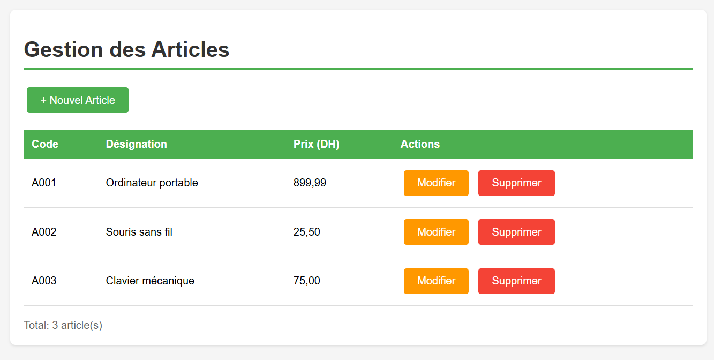
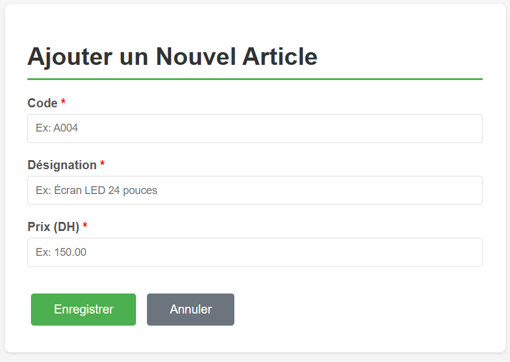
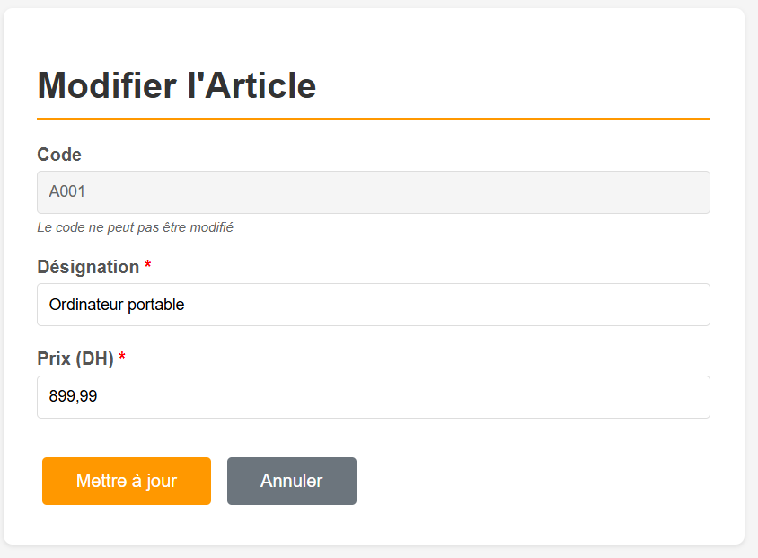
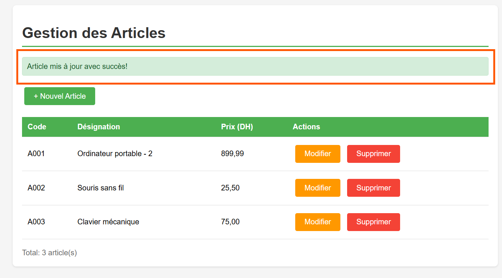

# Application CRUD Articles - Java MVC avec Front Controller

## Description
Application web Java pour gérer des articles (code, désignation, prix) en utilisant le pattern MVC avec un **Front Controller unique** mappé sur `/app`. Toutes les opérations CRUD passent par cette servlet centrale.

## Architecture

### Structure du Projet
```
src/
├── model/
│   ├── Article.java          # Entité Article
│   └── DaoArticle.java        # DAO en mémoire (Singleton)
└── controller/
    └── FrontController.java   # Servlet unique pour toutes les opérations

webapp/
├── WEB-INF/
│   ├── views/
│   │   ├── listeArticles.jsp # Liste des articles
│   │   ├── Article.jsp        # Formulaire création
│   │   └── EditArticle.jsp    # Formulaire édition
│   └── web.xml                # Configuration
└── index.jsp                  # Redirection vers /app
```

### Choix Techniques

#### 1. **Front Controller Pattern**
- Une seule servlet (`FrontController`) mappée sur `/app`
- Gère toutes les requêtes via le paramètre `action`
- Centralise la logique de navigation et de contrôle

#### 2. **DAO Singleton**
- `DaoArticle` implémenté en Singleton pour garantir une instance unique
- Stockage en mémoire avec une `ArrayList<Article>`
- Données initialisées avec 3 articles de test

#### 3. **MVC Strict**
- **Model**: `Article` (entité) + `DaoArticle` (gestion données)
- **View**: JSP dans `/WEB-INF/views/` (protégées)
- **Controller**: `FrontController` (routage et orchestration)

#### 4. **Gestion des Actions**
- **GET**: `list`, `new`, `edit`, `delete`
- **POST**: `create`, `update`
- Redirection vers la liste après chaque opération

## URLs et Actions

### Actions disponibles

| Action | Méthode | URL | Description |
|--------|---------|-----|-------------|
| **list** | GET | `/app` ou `/app?action=list` | Afficher tous les articles |
| **new** | GET | `/app?action=new` | Afficher formulaire création |
| **create** | POST | `/app?action=create` | Créer un nouvel article |
| **edit** | GET | `/app?action=edit&code=XXX` | Afficher formulaire édition |
| **update** | POST | `/app?action=update` | Mettre à jour un article |
| **delete** | GET | `/app?action=delete&code=XXX` | Supprimer un article |


## Fonctionnalités

### CREATE (Créer)
- Formulaire de saisie avec validation
- Vérification de l'unicité du code
- Message de confirmation ou d'erreur

### READ (Lire)
- Liste complète des articles
- Affichage en tableau avec design moderne
- Compteur d'articles

### UPDATE (Modifier)
- Formulaire pré-rempli avec les données actuelles
- Code non modifiable (clé primaire)
- Mise à jour de la désignation et du prix

### DELETE (Supprimer)
- Confirmation JavaScript avant suppression
- Suppression immédiate
- Message de confirmation

## Sécurité et Bonnes Pratiques

### Protection des JSP
- Toutes les vues dans `/WEB-INF/views/`
- Accès impossible en URL directe
- Passage obligatoire par le contrôleur

### Validation
- Validation côté client (HTML5 required)
- Validation côté serveur dans le DAO
- Gestion des erreurs avec messages utilisateur

### Gestion des Erreurs
- Try-catch dans le contrôleur
- Messages d'erreur explicites
- Pages d'erreur personnalisées (404, 500)

## Données de Test

L'application est initialisée avec 3 articles:

| Code | Désignation | Prix |
|------|-------------|------|
| A001 | Ordinateur portable | 899.99 DH |
| A002 | Souris sans fil | 25.50 DH |
| A003 | Clavier mécanique | 75.00 DH |

## Captures d'Écran

### 1. Liste des Articles

- Tableau avec tous les articles
- Boutons d'action (Modifier, Supprimer)
- Bouton "Nouvel Article"

### 2. Créer un Article

- Formulaire de saisie
- Validation des champs
- Boutons Enregistrer/Annuler

### 3. Modifier un Article

- Formulaire pré-rempli
- Code désactivé (non modifiable)
- Mise à jour désignation et prix

### 4. Messages de Confirmation

- Message de succès (vert)
- Message d'erreur (rouge)


## Bilan

Cette application démontre:
- Pattern MVC strict
- Front Controller efficace
- CRUD complet sans base de données
- Code maintenable et extensible
- Interface utilisateur moderne
